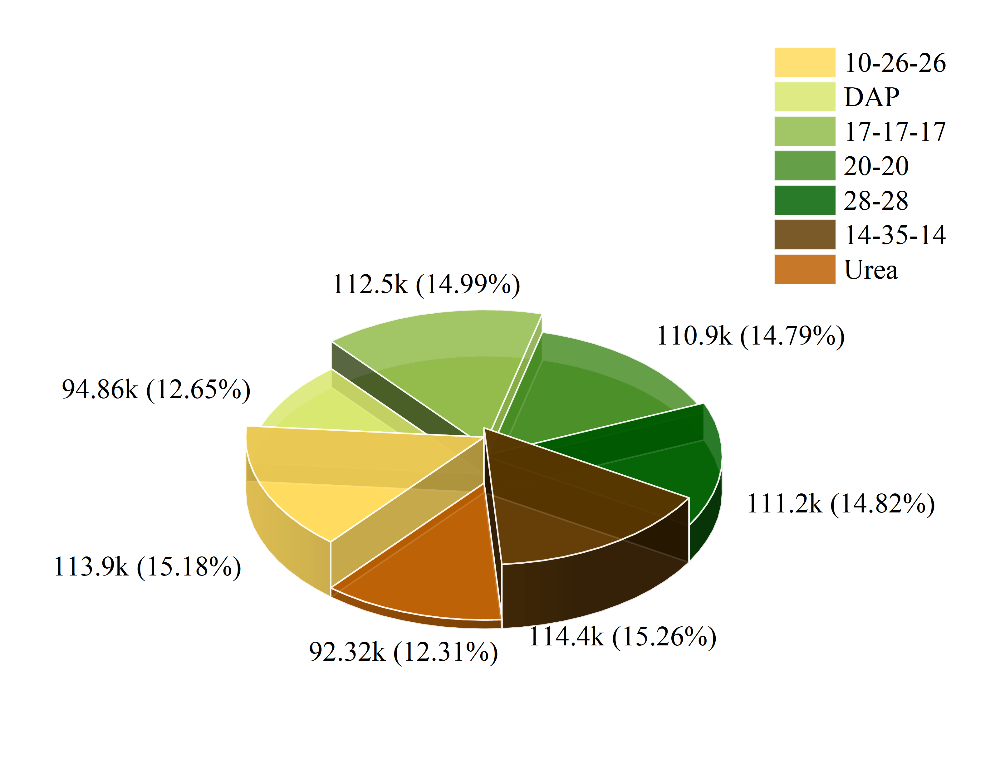
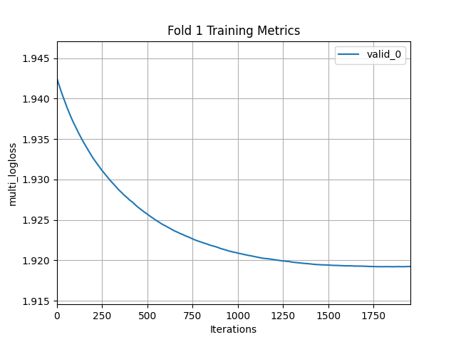
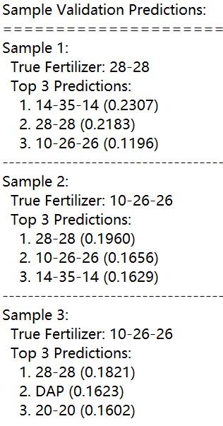
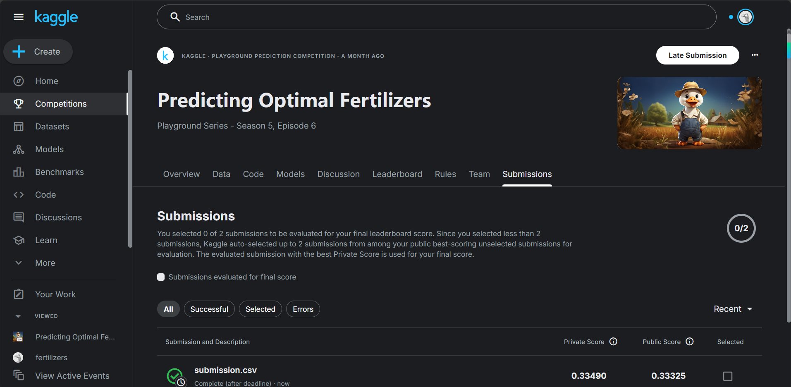

# **肥料推荐系统**


## 项目介绍

该项目是一个基于机器学习的肥料推荐系统，通过分析土壤特性和环境条件，预测最适合的肥料类型。系统使用LightGBM梯度提升框架构建多分类模型，采用5折分层交叉验证训练，并实现了创新的MAP@3评估指标（Mean Average Precision at Top 3），确保推荐结果既准确又具有实际应用价值。

## 数据集说明

==数据集和项目来源与kaggle竞赛：[Predicting Optimal Fertilizers | Kaggle](https://www.kaggle.com/competitions/playground-series-s5e6)==

数据集不同肥料种类分布图：


### 文件

- **train.csv** - 训练数据集; 是分类目标`Fertilizer Name`
- **test.csv** - 测试数据集;您的目标是预测每行最多三个值，以空格分隔。`Fertilizer Name`
- **sample_submission.csv** - 格式正确的示例提交文件。

### 数据特征

|     特征名      | 类型 |                      描述                       |
| :-------------: | :--: | :---------------------------------------------: |
|       id        | 数值 |                  样本唯一标识                   |
|   Temparature   | 数值 |                      温度                       |
|    Humidity     | 数值 |                      湿度                       |
|    Moisture     | 数值 |                   土壤含水量                    |
|    Soil Type    | 类别 |   土壤类型(Sandy、Black、Clayey、Red、Loamy)    |
|    Crop Type    | 类别 | 作物类型(Paddy、Pulses、Cotton、Tobacco、Wheat) |
|    Nitrogen     | 数值 |                     氮含量                      |
|    Potassium    | 数值 |                     钾含量                      |
|   Phosphorous   | 数值 |                     磷含量                      |
| Fertilizer Name | 类别 |         目标变量(14-35-14、10-26-26等)          |

### 评估

根据平均精度 @ 3 （MAP@3） 对提交进行评估：
$$
\mathrm{MAP}@3 = \frac{1}{U} \sum_{u=1}^{U} \sum_{k=1}^{\min(n, 3)} P(k) \times \mathrm{rel}(k)
$$

其中 $U$ 是观测数，$P(k)$ 是截止时的精度 $k$,$n$ 是每个观测值的预测数，并且 $rel(k)$ 是一个指标函数，如果排名中的项目 $k$ 是相关（正确）标签，否则为零。

### 数据预处理

1. **特征工程**：
   - 营养元素比例：`N_P_ratio`, `N_K_ratio`, `P_K_ratio`
   - 环境交互特征：`Temp_Humidity`
   - 营养总量：`Nutrient_Sum`
2. **编码与标准化**：
   - 分类变量：Label Encoding
   - 数值变量：Standard Scaling


## 文件夹结构

```makefile
Fertilizer_Prediction/
├───README.md
├───requirements.txt
├───train.py 
├───data/  
    │   README-data.md            # 数据集说明文档
├───log/                          # 日志目录
└───output/
    ├───model/
    └───pic/                      # 图片输出目录
```


## 模型架构实现

### 核心算法

- **LightGBM** (Gradient Boosting Decision Tree)
- 多分类任务（22种肥料类型）
- GPU加速训练

### 关键参数配置

```python
params = {
    'objective': 'multiclass',
    'num_class': 22,
    'metric': 'multi_logloss',
    'boosting_type': 'gbdt',
    'num_leaves': 512,
    'max_depth': 12,
    'learning_rate': 0.005,
    'feature_fraction': 0.6,
    'bagging_fraction': 0.7,
    'lambda_l1': 0.1,
    'lambda_l2': 0.1,
    'device': 'gpu'
}
```

### 训练流程

1. **分层交叉验证**：
   - 5折StratifiedKFold (保持类别分布)
   - 早停机制(stopping_rounds=100)
2. **模型集成**：
   - 训练5个独立模型
   - 预测时概率平均融合
3. **评估指标**：
   - 自定义MAP@3函数

### 模型保存

- 每个交叉验证模型：`lgb_model_fold{i}.txt`
- 预处理对象：`label_encoders.pkl`, `scaler.pkl`
- 完整训练模型：`lgb_model_final.txt`


## 快速开始

### 环境要求

```bash
pip install -r requirements.txt
```

### 训练模型

1. 准备数据：

   - 将`train.csv`和`test.csv`放入`data `文件夹

2. 执行训练脚本：

   ```bash
   python train.py
   ```

3. 输出结果：

   - 训练指标图：`training_metrics_fold{i}.png`
   - 模型文件：`/kaggle/working/model/`
   - 预测结果：`submission.csv`

## 结果展示

### 模型性能

| 评估指标      | 值                            |
| :------------ | :---------------------------- |
| **平均MAP@3** | 0.3317 ± 0.0004               |
| 训练时间      | 3h 20m 25s（五折） · GPU P100 |

训练历史记录（此处仅展示其中一次）：



验证集上进行测的样本输出：



战绩可查 ∠( ᐛ 」∠)_：

