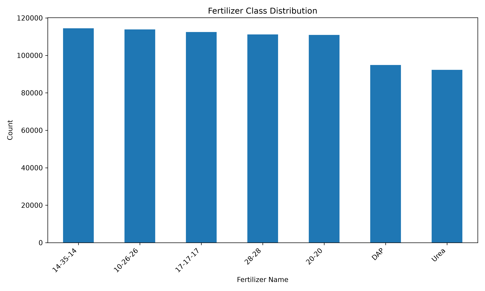
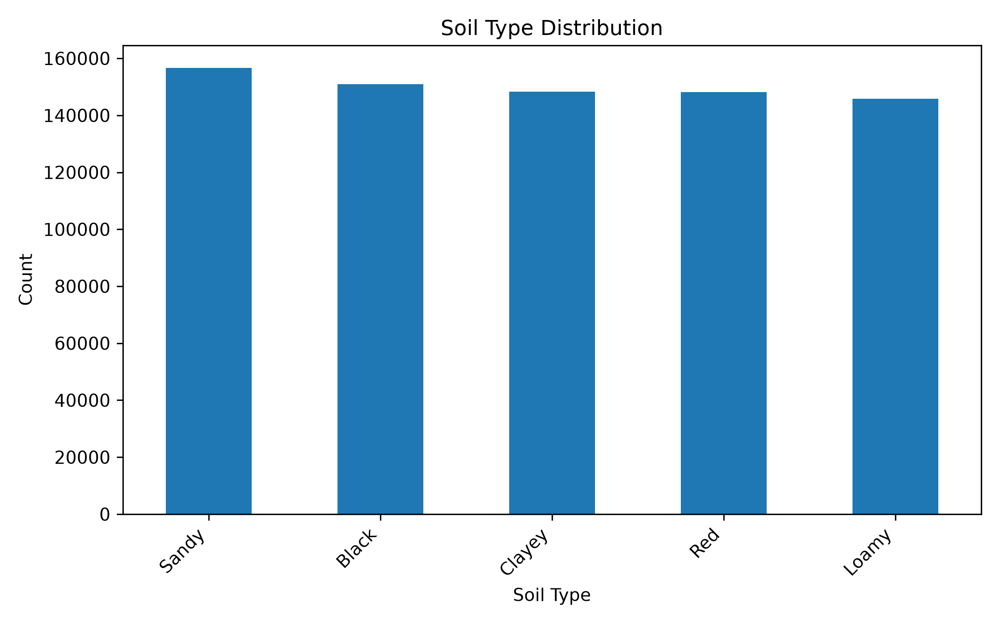
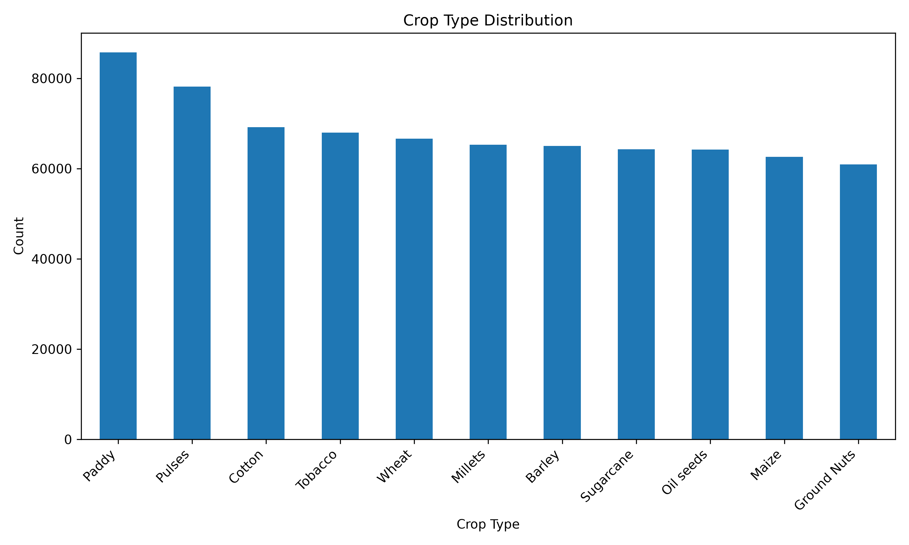
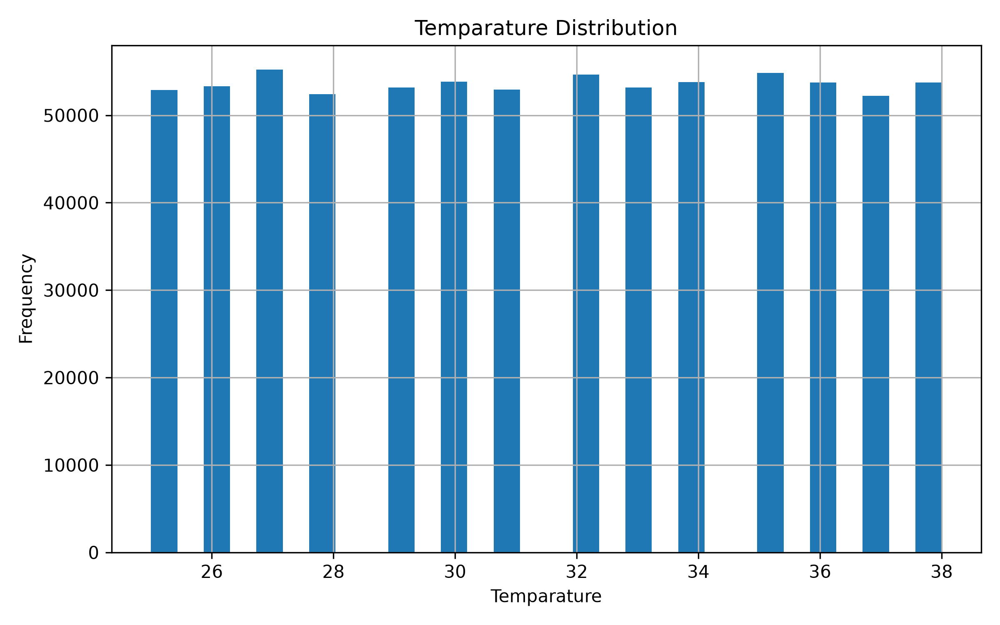
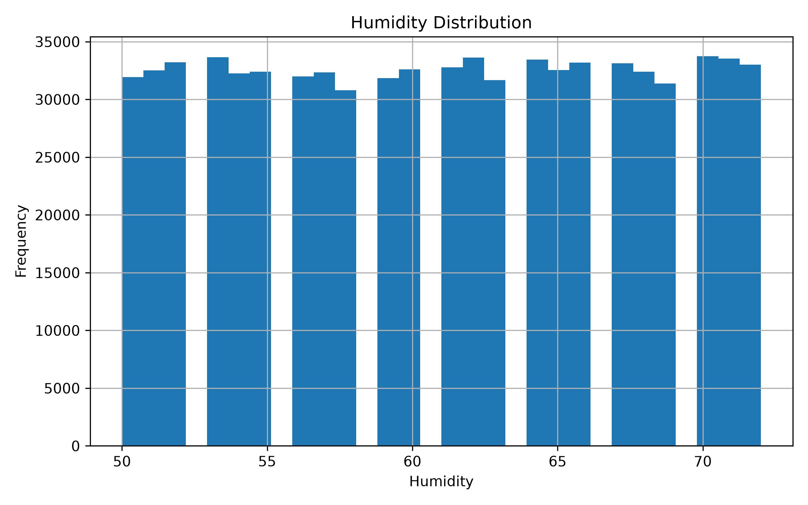
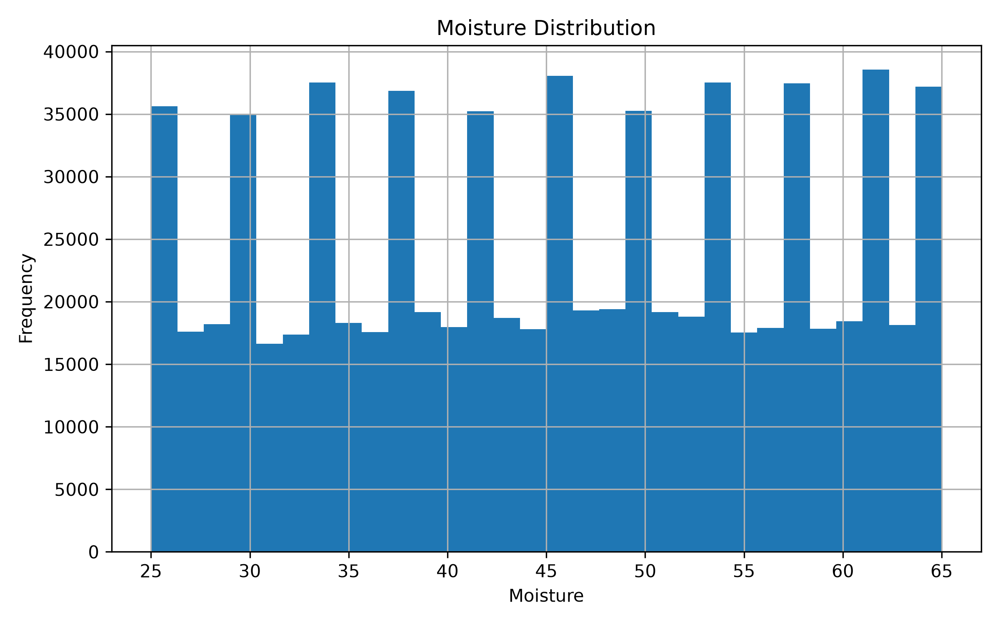
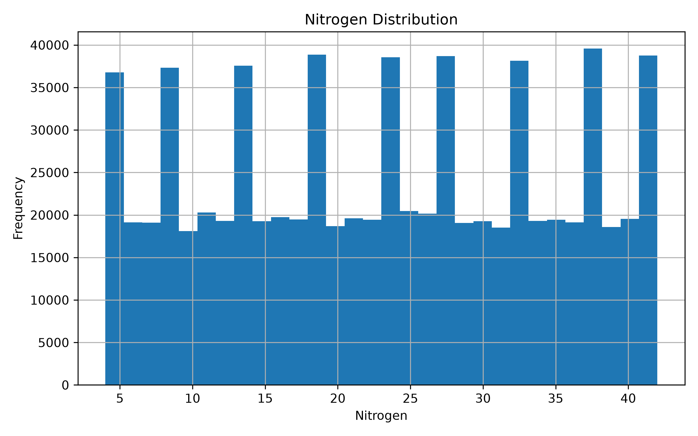
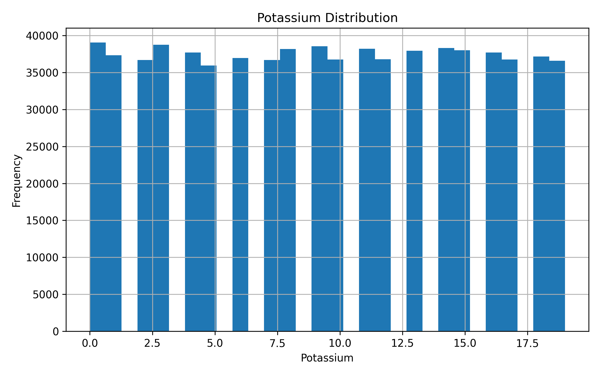
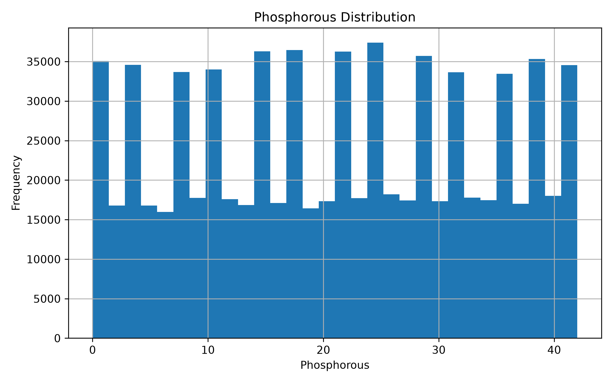

# 数据分析

## 1. 肥料类别分布

通过 `eda.py` 对训练数据进行了探索性分析。肥料类别分布如下：

| 肥料类别 | 样本数 |
|----------|--------|
| 14-35-14 | 114,436 |
| 10-26-26 | 113,887 |
| 17-17-17 | 112,453 |
| 28-28 | 111,158 |
| 20-20 | 110,889 |
| DAP | 94,860 |
| Urea | 92,317 |

从类别分布看，不同肥料类别样本数量存在一定差异，但整体没有出现极端类别稀缺的情况。

## 2. 土壤类型分布

## 3. 作物类型分布

## 4. 环境变量分布

### 温度分布

### 湿度分布

### 土壤水分分布

## 5. 养分含量分布

### 氮含量分布

### 钾含量分布

### 磷含量分布

